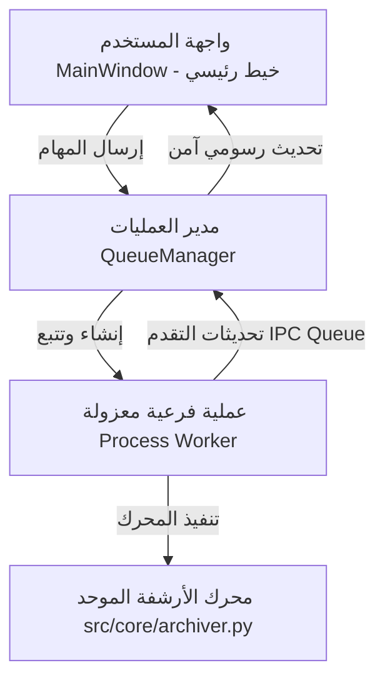

# المعمارية الهندسية لبرنامج ZRar (Architecture & System Design)

يوثق هذا الملف المعايير المعمارية، وأنماط التصميم (Design Patterns)، والخيارات الهندسية المتبعة في بناء وتطوير برنامج **ZRar**.

---

## 1. الهيكل المعماري وعزل العمليات (Process Isolation)

يعتمد تطبيق **ZRar** على معمارية عزل صارمة تفصل تماماً بين واجهة المستخدم (GUI) ومحرك المعالجة (Archiving Engine) لمنع تجمد الواجهة أو انهيارها (GIL Bypass):

### أ. خيط الواجهة الرسومية (Main GUI Thread)
* يعمل على واجهة `customtkinter` (مبنية فوق `Tkinter`).
* لا يحتوي على أي عمليات إدخال وإخراج (I/O) ثقيلة أو عمليات حسابية مجهدة.
* يستعلم بشكل دوري (كل 50ms) عن طابور الرسائل المشترك (IPC Queue) لتحديث مؤشرات التقدم والسرعة.

### ب. العمليات الفرعية المعزولة (Isolated Worker Processes)
* تُطلق كل مهمة ضغط أو فك ضغط في بيئة معزولة تماماً (`multiprocessing.Process`).
* يمتلك العامل المعزول GIL (مؤشر قفل عام) خاصاً به، مما يمنع تصادم الخيوط.
* يتواصل مع الخيط الرئيسي عبر طابور اتصال بين العمليات (`multiprocessing.Queue`).

---

## 2. إدارة وقاية البيانات والأرشفة الذرية (Atomic Transactions)

لحماية بيانات المستخدم من التلف عند انقطاع الطاقة أو التوقف المفاجئ للعمليات:
1. **الكتابة المؤقتة (Temporary Stage)**: يتم كتابة الأرشيف الجديد تحت اسم مؤقت (مثال: `archive.7z.tmp`).
2. **التحقق (Verification)**: عند اكتمال العملية بنجاح وبدون أي استثناءات، يتم حذف أي نسخ قديمة واستبدال الملف المؤقت بالاسم النهائي تلقائياً.
3. **التنظيف التلقائي (Automatic Cleanup)**: في حال حدوث إلغاء يدوي أو فشل في العملية، يقوم المحرك بمسح الملفات المؤقتة بالكامل لضمان عدم تلويث مجلد المستخدم ببيانات تالفة.

---

## 3. قاعدة البيانات ونظام الكاش المتطور (SQLite Metadata Cache)

لتسريع عملية تصفح واستكشاف الأرشيفات العملاقة (مئات الجيجابايت) دون الحاجة لقراءة الملف بالكامل في كل مرة:
* يتم تخزين فهارس الملفات المضغوطة (قائمة الأسماء، الأحجام، التواريخ) في قاعدة بيانات SQLite محلية خفيفة (`cache_manager.py`).
* عند فتح أرشيف تم تصفحه مسبقاً، يسترجع البرنامج الهيكل فوراً في أجزاء من الثانية بدلاً من استهلاك المعالج في إعادة قراءة الملف.

---

## 4. استراتيجيات تحسين الأداء (High-Performance Pipeline)

| التقنية المتبعة | طريقة العمل | الهدف منها |
| :--- | :--- | :--- |
| **التخزين التكيفي (Smart Store)** | تجاوز ضغط صيغ الميديا والأرشيفات (`.mp4`, `.zip`...) | سرعة فائقة وحماية المعالج من الجهد غير المجدي |
| **تقييد التحديثات (Throttling)** | قصر رسائل التقدم للواجهة على 4 تحديثات بالثانية (250ms) | خفض استهلاك وحدة المعالجة المركزية واستقرار المؤشرات |
| **توسيع الذاكرة المؤقتة (Buffer Scaling)** | استخدام مخزن مؤقت بحجم 8MB للعمليات التكرارية | تقليل عدد استعلامات القرص (HDD/SSD) لأقصى حد |
| **التقسيم المجزأ (Volume Splitting)** | تقسيم الأرشيف لأجزاء متسلسلة عبر `multivolumefile` | تجاوز حدود أنظمة الملفات وسهولة النقل السحابي |
